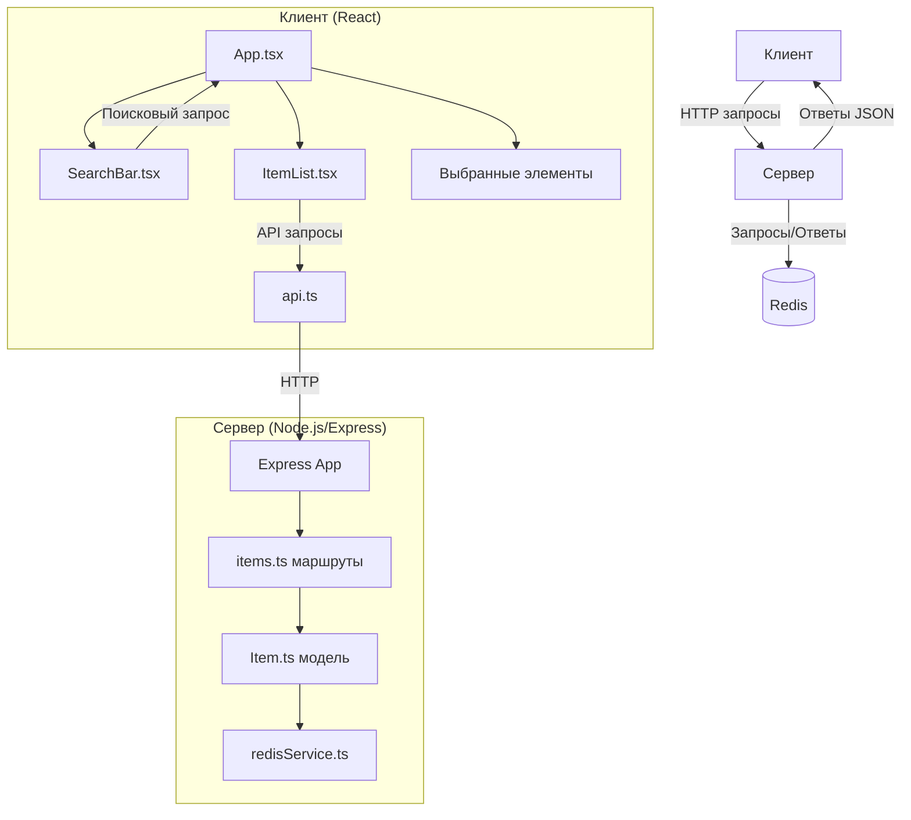

# Проект управления большим набором данных

## Обзор проекта

Этот проект представляет собой клиент-серверное приложение для работы с большим набором данных (до 1 миллиона элементов). Приложение позволяет просматривать, искать, выбирать и изменять порядок элементов с оптимизированной производительностью.

### Основные функциональности:

- Отображение списка элементов с пагинацией
- Поиск элементов по значению
- Выбор/отмена выбора элементов
- Изменение порядка элементов с помощью Drag&Drop
- Отображение выбранных элементов

### Технологический стек:

- **Серверная часть**: Node.js, Express, Redis
- **Клиентская часть**: React, TypeScript, React Query, Styled Components

## Архитектура проекта

Проект построен на клиент-серверной архитектуре с использованием Redis для хранения и кэширования данных.



### Основные компоненты:

#### Серверная часть:

- **Express App (index.ts)** - основной сервер, обрабатывающий HTTP-запросы
- **Items Router (routes/items.ts)** - маршруты API для работы с элементами
- **Item Store (models/Item.ts)** - модель данных и логика работы с элементами
- **Redis Service (services/redisService.ts)** - сервис для работы с Redis

#### Клиентская часть:

- **App (App.tsx)** - основной компонент приложения
- **SearchBar (components/SearchBar.tsx)** - компонент для поиска элементов
- **ItemList (components/ItemList.tsx)** - компонент для отображения списка элементов
- **API Service (services/api.ts)** - сервис для взаимодействия с API

## Технологии и инструменты

### Серверная часть:

- **Node.js и Express** - для создания REST API
- **Redis** - для хранения и кэширования данных
- **TypeScript** - для типизации и улучшения качества кода

### Клиентская часть:

- **React** - для создания пользовательского интерфейса
- **TypeScript** - для типизации и улучшения качества кода
- **React Query** - для кэширования и управления состоянием данных
- **Styled Components** - для стилизации компонентов

### Оптимизации:

- **Ленивая загрузка данных** - элементы создаются при первом запросе
- **Многоуровневое кэширование** - Redis на сервере, React Query на клиенте
- **Debounce для поисковых запросов** - предотвращение слишком частых запросов
- **Пагинация** - для эффективной работы с большим набором данных

## Сложности и решения

### 1. Работа с большим объемом данных (1 миллион элементов)

**Проблема**: Хранение и обработка 1 миллиона элементов требует значительных ресурсов памяти и процессора.

**Решение**:

- Использование Redis для эффективного хранения и доступа к данным
- Ленивая загрузка данных (элементы создаются только при первом запросе)
- Хранение только необходимых данных в памяти

### 2. Оптимизация производительности

**Проблема**: Медленная загрузка и обработка большого количества данных.

**Решение**:

- Использование отсортированных множеств в Redis для эффективного доступа к элементам
- Пагинация данных на сервере
- Оптимизация запросов к базе данных

### 3. Кэширование

**Проблема**: Повторные запросы к одним и тем же данным создают дополнительную нагрузку.

**Решение**:

- Многоуровневое кэширование:
  - Redis на сервере для кэширования результатов запросов
  - React Query на клиенте для кэширования ответов API
- Инвалидация кэша при изменении данных

### 4. Поиск по большому набору данных

**Проблема**: Медленный поиск по миллиону элементов.

**Решение**:

- Оптимизированные алгоритмы поиска
- Кэширование результатов поиска
- Ограничение количества проверяемых элементов для повышения производительности

### 5. Отображение большого списка на клиенте

**Проблема**: Производительность браузера при рендеринге большого списка.

**Решение**:

- Пагинация данных
- Отображение только необходимого количества элементов
- Планы по внедрению виртуализации списка

## Планируемые улучшения

1. **Внедрение RediSearch для более эффективного поиска**

   - Позволит выполнять сложные поисковые запросы непосредственно в Redis
   - Значительно повысит производительность поиска

2. **Доработка виртуализации списка на клиенте**

   - Внедрение react-window для эффективного рендеринга больших списков
   - Улучшение UX при прокрутке большого количества элементов

3. **Оптимизация кэширования**

   - Улучшение стратегий инвалидации кэша
   - Более гибкие настройки времени жизни кэша

4. **Добавление фильтрации и сортировки данных**
   - Расширение API для поддержки различных параметров фильтрации
   - Добавление возможности сортировки по различным полям

## Инструкции по установке и запуску

### Требования

- Node.js (версия 14 или выше)
- Redis (версия 6 или выше)

### Установка зависимостей

1. Клонировать репозиторий:

```bash
git clone <url-репозитория>
cd <название-проекта>
```

2. Установить зависимости для сервера:

```bash
cd server
npm install
```

3. Установить зависимости для клиента:

```bash
cd ../client
npm install
```

### Настройка Redis

1. Установить Redis (если не установлен):

   - Linux: `sudo apt-get install redis-server`
   - macOS: `brew install redis`
   - Windows: скачать и установить с официального сайта

2. Запустить Redis:
   - Linux/macOS: `redis-server`
   - Windows: запустить через установленное приложение

### Запуск приложения

1. Запустить сервер:

```bash
cd server
npm run dev
```

2. Запустить клиент:

```bash
cd ../client
npm run dev
```

3. Открыть приложение в браузере:

```
http://localhost:5173
```

---

Проект разработан с использованием современных технологий и подходов для обеспечения высокой производительности при работе с большим объемом данных.
